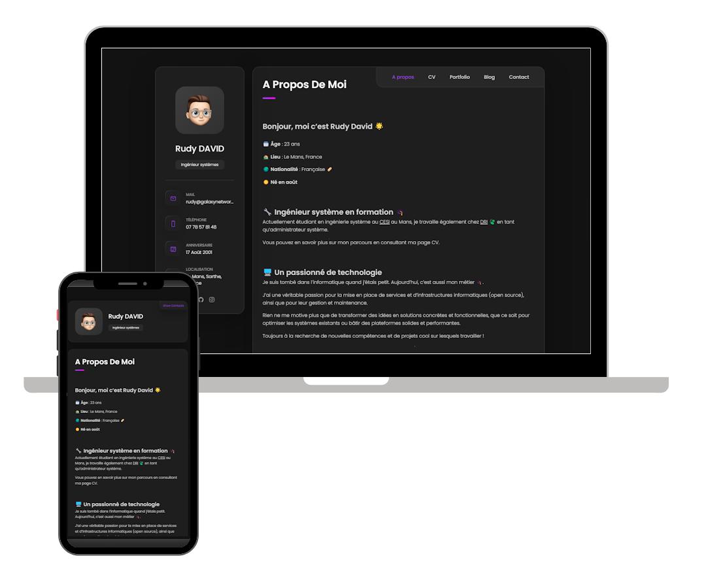

<h2 align="center">
  Portfolio Personal
  <br/>
  <a href="https://portfolio.galaxynetwork.fr" target="_blank">portfolio.galaxynetwork.fr</a>
</h2>

---

<div align="center">
  
</div>

<br/>

<div align="center">

[](https://forthebadge.com) &nbsp;
[](https://forthebadge.com) &nbsp;
[](https://forthebadge.com) &nbsp;
[](https://forthebadge.com) &nbsp;
[](https://forthebadge.com) &nbsp;
</div>

---

## Installing the Portfolio

To install **Portfolio Personal**, follow these steps:

Linux and macOS:

```bash
sudo git clone https://github.com/PetitPrinceQLF/WEB-Portfolio-Personal.git
```

Windows:

```bash
git clone https://github.com/PetitPrinceQLF/WEB-Portfolio-Personal.git
```

---

## Credit

Special thanks to [codewithsadee](https://github.com/codewithsadee) for creating the original [vCard Personal Portfolio](https://github.com/codewithsadee/vcard-personal-portfolio).

## Contact

If you want to contact me you can reach me at rudy@galaxynetwork.fr.

---

### Show your support

Give a ⭐ if you like this website!
